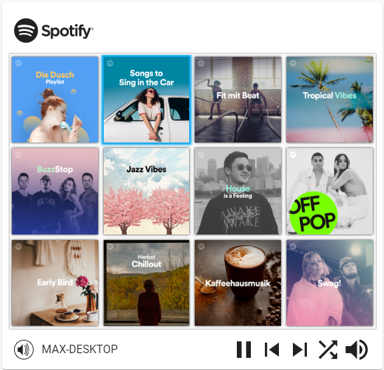
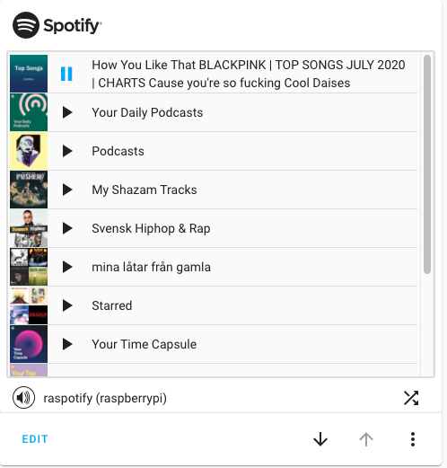
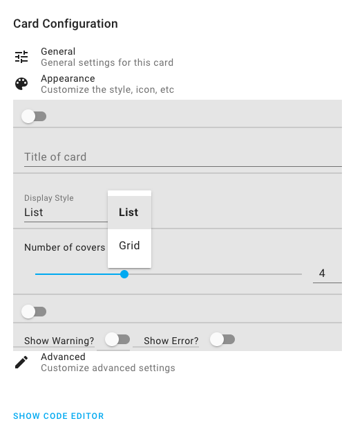

[](https://github.com/hacs/integration) [](https://github.com/custom-cards/spotify-card)


## Home Assistant Spotify Lovelace Card

**DISCLAIMER**: _This project is a private open source project and doesn't have any connection with Spotify._

This card supports listing the users currently available devices and the users playlists on [Spotify](https://www.spotify.com). Choose an online media player and click on a playlist to play it on the device. This component will query the current playback from the [Spotify Integration](https://www.home-assistant.io/integrations/spotify/) and tries to reflect the currently playing playlist.

The component uses the [Spotify Integration](https://www.home-assistant.io/integrations/spotify/) and [spotcast](https://github.com/fondberg/spotcast) and both of them have to be installed for the card to function properly.

The forum thread can be found [here](https://community.home-assistant.io/t/spotify-lovelace-card/103525)



## See release information on Github for release notes

### Requirements

[Spotify Integration](https://www.home-assistant.io/integrations/spotify/) and [spotcast](https://github.com/fondberg/spotcast) have to be installed (Spotcast is needed for many other things than playing on cast devices).
This card should work in all newer major browsers. If it does not work for you please provide detailed reports in an issue ticket.

### Installation

#### HACS users

Follow the HACS instructions when installing it.

#### Manually

Copy the content of the `dist` folder to `www/community/spotify-card/` in your Home Assistant configuration directory. Create these folders if they do not exist.

Then you have to add spotify card to your resources. This can be done via `Settings -> Lovelace Dashboards -> Resources`. Add this path:

```
  /local/community/spotify-card/spotify-card.js
```

If you do not have the `Resources` tab available, you have to enable the advanced mode for Lovelace. To do so, click on your username on your Home Assistant dashboard and enanble the setting.

### Usage

Add the card via lovelace to your dashboard. All of the settings can be configured via the visual editor.

#### Advanced usage

##### Device filtering

If you want to hide specific devices, you can do so in the advanced tab of the visual editor. If you are not using the visual editor see [YAML mode](YAML-mode).
You can enter as many regular expressions as you like, separated by a comma. If any of these rules apply to a device-name it will be hidden. The rules are evaluated against the whole device-name so `room` will not match `bedroom`. Here are a few examples:

- `.*room` hides all devices ending with room
- `bath.*,kids.*` hides all devices which start with bath or kids

##### Playlist filtering

You can filter the playlists you want on a specific card instance. Just enter as many regular expressions as you like, separated by a comma.
Playlists are first requested through spotcast websocket API, and *then* filtered. It means that if you fetch 10 playlists, only those 10 will be filtered.

The filters are inclusive, so it means that, as soon as you set at least one filter, a playlist will be included *only* if it matches at least one filter.

Filters can apply on any top-level attributes (ie any attributes defined in [interface](https://github.com/custom-cards/spotify-card/blob/master/src/types.ts#L129)).

You can specify filters in 2 ways:

- with only pattern, ex `.*rock.*`, then it will filter only on `name` attribute
- with field + pattern, ex `description:.*rock.*`, then it will filter on given field.

##### Known Spotify Connect devices

You can specify a pre-known Spotify Connect devices that are not showing up in the devices list although they are available in the network.
This is useful for smart WiFi speakers that are not connected specifically to your Spotify account and are available visible only inside the home WiFi network, such as Sonos speakers. 

To add a device, start a playback on it and then click the add button in the card editor. You can also manually configure devices, if know the device id (see [spotcast guide for finding the device id](https://github.com/fondberg/spotcast#find-spotify-device-id)).

#### YAML mode

If you are not using the visual configuration of Lovelace you can add the card like this:

```yaml
  cards:
    - type: 'custom:spotify-card'
      account: <optional> which account to use for spotcast. Defaults to "default"
      height: <optional pixels height for the playlist element. If content is larger scrolling will be enabled>
      limit: <optional number of playlists to retrieve (default 10)>
      device: <optional name of a device to pre-select>
      playlist_type: <optional featured|discover-weekly> Change type of playlists shown. Default are your normal playlists.
      always_play_random_song: <optional true> Set to start playlists from a random song.
      country_code: <optional country code to show featured playlist relevent to a particular country. https://en.wikipedia.org/wiki/ISO_3166-1_alpha-2 >
      hide_warning: <optional true> Hide warnings if they are displayed.
      name: <optional name> Custom title. Leave empty to hide.
      display_style: <optional Grid> Change default display style.
      grid_covers_per_row: <optional number> Number of covers per row (default 3) in Grid-view.
      spotify_entity: <optional> Name of your spotify media player entity if it doesn't start with "spotify"
      default_device: <optional> Name of your spotify connect or chromecast device, e.g. "Kitchen"
      filter_devices: <optional Array> Hides devices which matches any array entry. The entries have to be regular expressions and are matched against the full device-name. The following are examples
        - .*room <hides all devices ending with room>
        - bath.*,kids.* <hides all devices which start with bath or kids>
      known_connect_devices: <optional> List of known Spotify Connect devices, see [Known Spotify Connect devices](Known-Spotify-Connect-devices) section
        - id: The Spotify Connect device id
          name: The name of the device
          entity_id: <optional> The Home Assistant media player entity id of this device (e.g. from Sonos integration)
```

### Screenshots




### General usage

This library can of course also be used on other websites or projects other than Home Assistant

### CONTRIBUTING

Please contribute and help. Before creating a large PR make sure to sync about it with me.

### License

This library is licensed under Apache 2.0, see [LICENSE](./LICENSE)
